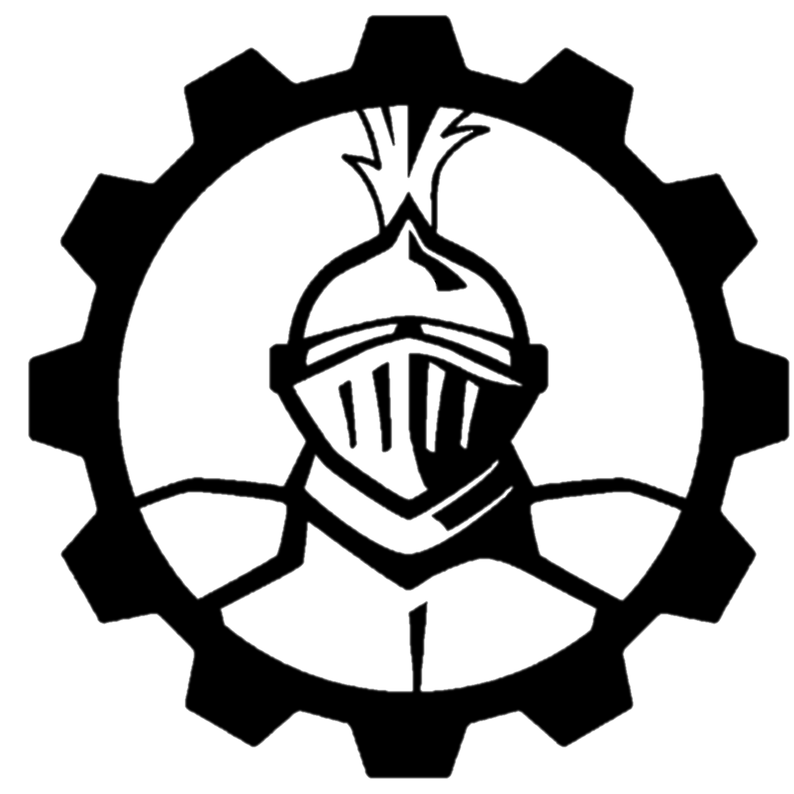

	
	<h1>2024 Bot for CRESCENDO</h1>
	

		<b>🤖 Framework and game specific code used for this year's robot</b>
	

    
     
    
    
     
	 
	 
	 

# Contributing

See `CONTRIBUTING.md` for more information

# License

This project is licensed under the BSD-2 license.
 
&copy; 2024 Team 501 - The PowerKnights. Please see `Team501-License` and `WPILib-License` for full license details.
